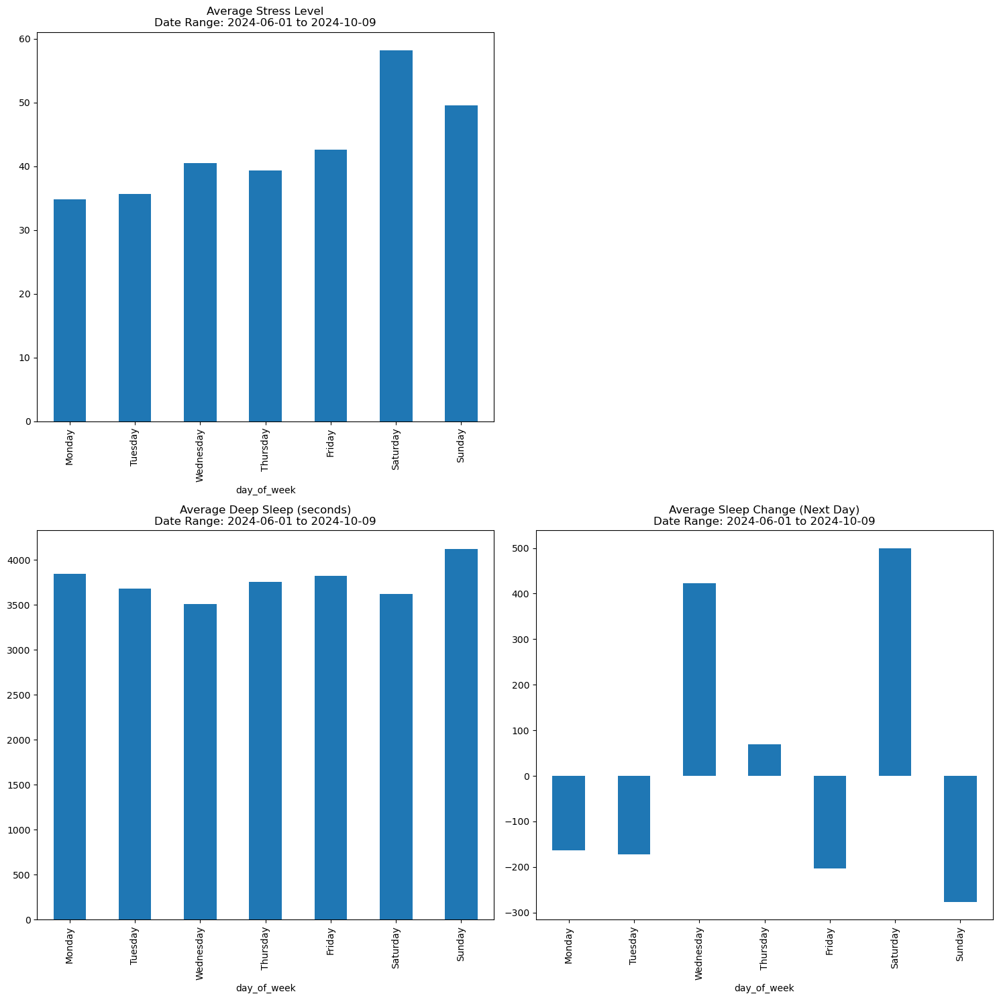

# Garmin Analysis

## Overview

Garmin Analysis is a project designed to analyze and visualize data from Garmin fitness devices. This tool helps users gain insights into their fitness activities, performance metrics, and progress over time.

## Features

- Fetch data from Garmin Connect
- Analyze various fitness metrics (e.g., heart rate, pace, distance)
- Generate visualizations and reports
- Track progress and set goals
- Determine optimal exercise days for better sleep balance

## Installation

To set up the Garmin Analysis project, follow these steps:

1. Clone the repository:
   ```
   git clone https://github.com/tuckwoor/garmin_analysis.git
   cd garmin_analysis
   ```

2. Install the required dependencies:
   ```
   pip install -r requirements.txt
   ```

3. Set up your Garmin Connect credentials (see Configuration section)

## Configuration

1. Create a `.env` file in the project root directory
2. Add your Garmin Connect credentials to the `.env` file:

```
GARMIN_USERNAME=your_garmin_connect_email
GARMIN_PASSWORD=your_garmin_connect_password
```

Replace `your_garmin_connect_email` and `your_garmin_connect_password` with your actual Garmin Connect credentials.

## Usage

1. Fetch data from Garmin Connect:
   ```
   python fetch_garmin_data.py
   ```
   This script will use the credentials from your `.env` file to authenticate and download your Garmin data.

2. Run the main analysis script:
   ```
   python analyze_garmin_data.py
   ```

3. Follow the prompts to select the date range and metrics you want to analyze

4. View the generated reports and visualizations in the `output` directory

## Data Privacy

Your Garmin Connect credentials are stored locally in the `.env` file and are never transmitted or stored elsewhere. The fetched data is stored locally on your machine. Always be cautious about sharing your analysis results if they contain personal information.

## Contributing

Contributions are welcome! Please feel free to submit a Pull Request.

## License

This project is licensed under the GNU General Public License (GPL).

## Acknowledgments

- Thanks to the [Garmin Connect API](https://developer.garmin.com/connect-api/overview/) for providing access to fitness data

## Troubleshooting

If you encounter issues with data fetching:
1. Ensure your Garmin Connect credentials in the `.env` file are correct
2. Check your internet connection
3. Verify that the Garmin Connect API is operational

For any other issues, please open an issue on the GitHub repository.

## Analysis and Visualization

The `garmin_analysis.py` script is designed to help users find the optimal day of the week for heavier exercise to better balance their sleep patterns. By analyzing the relationship between exercise intensity and sleep quality across different days of the week, the script provides insights into when more intense workouts might lead to improved sleep.

### Sample Visualizations

#### Combined Score Analysis


This visualization shows the combined score of exercise intensity and sleep quality for each day of the week. Higher scores indicate a better balance between exercise and sleep.

#### Additional Plots


These plots provide more detailed insights into various metrics, such as:
- Exercise intensity by day of the week
- Sleep quality by day of the week
- Correlation between exercise intensity and sleep quality

By examining these visualizations, users can identify patterns and make informed decisions about when to schedule their more intense workouts for optimal sleep balance.
